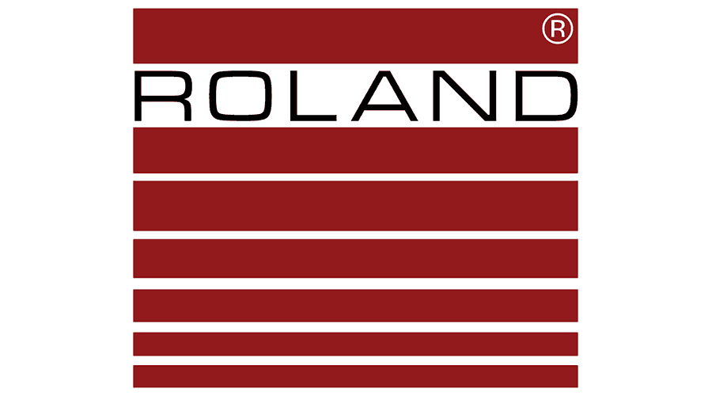

 

    
    
    www.safeworkplace.org 
    (262) 652-8660 
    joe@industrialsafetycontrols.com | safetysensing@earthlink.net

<table class="tg">
    <thead>
    <tr>
        <th class="tg-fpmh" >Contact Information</th>
    </tr>
    </thead>
</table>

Name: __________________________________   Company: __________________________________

Address: ________________________________   City: ____________________   State: ____   Zip: _______

Phone: ______________________   Cell: ______________________   Fax: ______________________

Email: __________________________________   Company Website: ______________________________

<table class="tg">
    <thead>
    <tr>
        <th class="tg-fpmh" >SAFETY RELAYS</th>
    </tr>
    </thead>
</table>

**Application:**
- [ ] Emergency Stop
- [ ] Two Hand Control
- [ ] Safety Interlock Switch
- [ ] Non-Contact Safety Switch
- [ ] Safety Solenoid Interlock Switch
- [ ] Safety Mat
- [ ] Safety Light Curtain
- [ ] Safety Relay Time Delayed Outputs
- [ ] Safety Laser Scanner
- [ ] Safety Single or Multiple Beams

**Type:**
- [ ] Single Purpose Safety Relay
- [ ] Dual Input Safety Relay
- [ ] Programmable Safety Relay

**Voltage Requirement:**
- [ ] 24VDC
- [ ] 110VAC
- [ ] 230VAC

**Circuit Type:**
- [ ] Emergency Stop Circuit
- [ ] Safety Stop Circuit
- [ ] Dual Channel
- [ ] Single Channel

**Related Safety Relays:**
- [ ] Standstill Monitor
- [ ] DC Brake

**Other Requirements:**

**Quantity Needed For This Project:**

**Target Price:**

**Target Delivery Date:**

**Cross Reference Part Number:**

<table class="tg">
    <thead>
    <tr>
        <th class="tg-fpmh" >SAFETY COMPONENT REQUIREMENTS</th>
    </tr>
    </thead>
</table>

- [ ] Light Curtains
- [ ] Two Hand Controls
- [ ] Emergency Stop Button
- [ ] Safety Mats
- [ ] Sensing Edge
- [ ] Bumber Switch
- [ ] Trapped Key Interlocking
- [ ] Interlock Switch
- [ ] Latching Interlock Switch
- [ ] RFID Safety Switch
- [ ] Non-Contact Safety Switch
- [ ] Hinge Safety Switch
- [ ] Laser Scanner
- [ ] Single or Multi-Beam

**Special Ratings:**
- [ ] IP69K
- [ ] EX Proof

**Other Requirements:**

**Quantity Needed For This Project:**

**Target Price:**

**Target Delivery Date:**

**Cross Reference Part Number:**

<table class="tg">
    <thead>
    <tr>
        <th class="tg-fpmh" >MACHINE SAFEGUARDING PRODUCTS</th>
    </tr>
    </thead>
</table>

- [ ] Physical Guarding
- [ ] Safety Light Curtain
- [ ] Safety Laser Scanner
- [ ] Safety Single or Multi-Beam System
- [ ] Safety Mats
- [ ] Safety Sensing Edge
- [ ] Safety Bumper Switch

**Emergency Stop Button:**
- [ ] 22mm
- [ ] 30mm
- [ ] Oversized
- [ ] Illuminated
- [ ] w/ Lockout Feature
- [ ] w/ Enclosure

**Cable Operated Safety Switch:**
- [ ] Slack Cable
- [ ] Cable Detection
- [ ] Single Ended
- [ ] Double Ended
- [ ] w/ Indicator Light

**Guard Door Monitoring Safety Switches:**
- [ ] Keyed Interlock
- [ ] Solenoid Latching Keyed Interlock
- [ ] Solenoid Latching Keyed Switch with Internal Release
- [ ] Non-Contact Switch
- [ ] Non-Contact Switch Stand Alone
- [ ] Non-Contact RFID Switch
- [ ] Latching Non-Contact Switch

**Trapped Key Interlocking System:** Y/N

**Two Hand Control:** Y/N

**Muting Required of Safety System For:**
- [ ] Material Transfer
- [ ] Loading/Unloading
- [ ] Part Forming

**Special Environmental and System Requirements:**
- [ ] Washdown / IP69K / IP68
- [ ] ATEX / Explosion Proof
- [ ] Dual Channel System
- [ ] Single Channel System

**Notes on Application:**

**Cross Reference Part Number:**

-------------------------------------------------------------------

    

            
            
            
            
            
            
            
             
    

